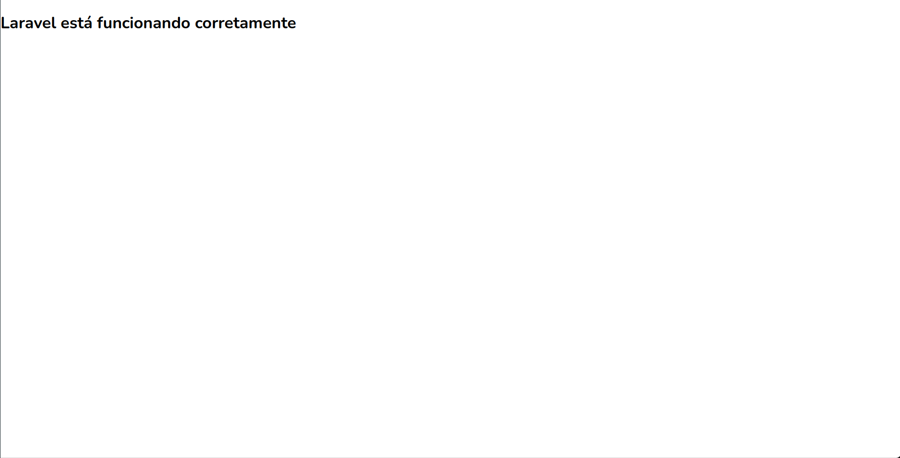

# Teste para Autocam
Backend CRUD Laravel para o teste da Autocam

## Rodando localmente
### Requisitos 
- PHP com versão igual ou superior a `8.0`. Recomendo `8.2.1` ou superior.
- Docker na versão mais recente
- WSL caso esteja utilizando windows

### Inicializar os containers do laravel e mysql:
```bash
# copiar .env.example para .env
cp ./.env.example ./.env
# inicializar os containers
./vendor/bin/sail up -d
```

Para verificar se o projeto está rodando, clique [aqui](http://localhost:8080) ou copie o link abaixo:

```http://localhost:8080```

A seguinte tela aparecerá se estiver funcionando corretamente:



